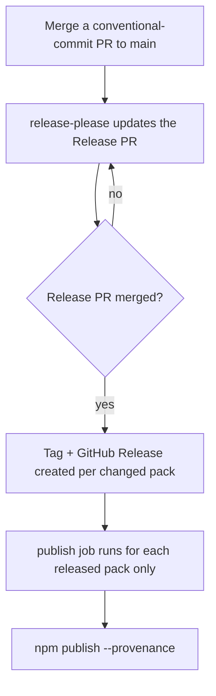

# Releasing

Every pack publishes to public npm from this repo via GitHub Actions. Versioning, changelogs, tags, GitHub Releases, and publishing are all automated by [release-please](https://github.com/googleapis/release-please).

You don't bump versions or cut releases by hand. You write [Conventional Commits](https://www.conventionalcommits.org/); release-please does the rest.

## How a release happens



1. **You merge a normal PR** to `main` with a conventional-commit title (`feat:`, `fix:`, etc.).
2. **release-please maintains a single open “Release PR”** that accumulates every pending change, bumps each affected pack's `version`, and updates that pack's `CHANGELOG.md`. Packs you didn't touch are untouched.
3. **When you merge the Release PR**, release-please creates a Git tag and GitHub Release for each bumped pack (e.g. `bluetemberg-rules-git-v0.2.0`).
4. **The publish job publishes only the packs that were just released** — not all 41 — each with a signed provenance statement.

## How publishing authenticates

Publishing uses a **granular npm access token** stored as the `NPM_TOKEN` repository (or org) secret. Each publish is still signed with **provenance** via GitHub's OIDC token (`id-token: write`), so consumers get a verifiable link back to the exact commit and workflow run that built the package.

Why a token and not OIDC [trusted publishing](https://docs.npmjs.com/trusted-publishers)? Because **OIDC cannot create a brand-new package name** ([npm/cli#8544](https://github.com/npm/cli/issues/8544)) — a trusted publisher can only be configured on a package that already exists. A token can create new names, so a brand-new pack publishes on its very first release with **zero per-pack setup**. That's the property this monorepo needs: adding packs is routine.

> **npm caps granular tokens at a 90-day lifetime.** Rotate `NPM_TOKEN` before it expires (npm emails a reminder). Rotation is a single action — regenerate the token, update one secret — not per-pack work.

## Versioning

Each pack carries its own `version` and is released independently. release-please derives the bump from your commit types:

| Commit type | Bump | Example |
| ----------- | ---- | ------- |
| `feat:` | minor | Adding/removing a rule — new behavior for consumers |
| `fix:` / `docs:` | patch | Editing rule wording |
| `feat!:` or `BREAKING CHANGE:` | major | A breaking restructure |

Scope the commit so release-please attributes it to the right pack — touch files under that pack's `packages/<name>/` directory in the same PR.

## Why only changed packs publish

`npm publish --workspaces` would attempt to publish all 41 packs on every release and **fail with `403` on every already-published version**. release-please reports exactly which paths it released (`paths_released`), and the publish job runs once per released path — the only correct shape for an incremental monorepo. This lives in `.github/workflows/release-please.yml`:

```yaml
strategy:
  matrix:
    path: ${{ fromJSON(needs.release-please.outputs.paths_released) }}
steps:
  - run: npm install -g npm@11              # pinned npm for provenance
  - run: npm ci
  - env: { NODE_AUTH_TOKEN: ${{ secrets.NPM_TOKEN }} }
    run: npm publish -w "$PKG_PATH" --provenance --access public
```

## One-time setup (per the repo owner)

Before the first automated publish, the `NPM_TOKEN` secret must exist:

1. **Create a granular access token** on npmjs.com → _Access Tokens_ → _Generate New Token_ → _Granular Access Token_:
   - **Permissions:** Read and write
   - **Packages:** All packages (so it can create brand-new pack names)
   - **Expiration:** up to 90 days (npm's maximum)
2. **Add it as a secret** named `NPM_TOKEN` (repo or org level):

   ```bash
   gh secret set NPM_TOKEN --repo prototypdigital/bluetemberg-packs
   # paste the token when prompted — it never touches your shell history
   ```

3. **Backfill any pack not yet on npm.** Run the **Bootstrap Publish** workflow once (Actions → _Bootstrap Publish_ → _Run workflow_). It detects every pack missing from the registry and publishes it with the token. After that, all releases for every pack flow through `release-please.yml` automatically.

When the token nears expiry, repeat steps 1–2 to rotate it. No other action is needed.

## Adding a new pack

Add the pack under `packages/`, then register it with release-please so it gets versioned:

1. Add `"packages/<name>": {}` to `release-please-config.json`.
2. Add `"packages/<name>": "0.1.0"` to `.release-please-manifest.json`.

That's it — no manual npm step. The next release that includes the pack publishes it for the first time via the token (and the `validate` job fails any pack missing from these two files, so you can't forget). See [Contributing](Contributing) for the pack layout.

## Wiki

This wiki is generated from `docs/wiki/*.md` in the repo. `.github/workflows/sync-wiki.yml` pushes any change under `docs/wiki/` to the GitHub Wiki on merge to `main` — edit the Markdown here, not the wiki directly.
