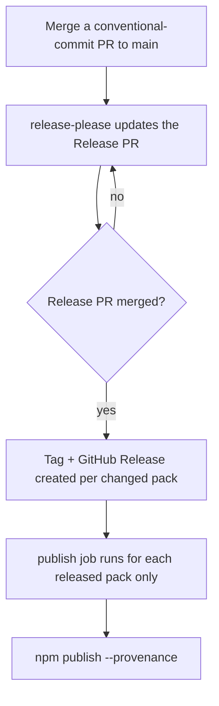

# Releasing

Every pack publishes to public npm from this repo via GitHub Actions using [npm Trusted Publishing (OIDC)](https://docs.npmjs.com/trusted-publishers) — no long-lived npm token. Versioning, changelogs, tags, GitHub Releases, and publishing are all automated by [release-please](https://github.com/googleapis/release-please).

You don't bump versions or cut releases by hand. You write [Conventional Commits](https://www.conventionalcommits.org/); release-please does the rest.

## How a release happens



1. **You merge a normal PR** to `main` with a conventional-commit title (`feat:`, `fix:`, etc.).
2. **release-please maintains a single open “Release PR”** that accumulates every pending change, bumps each affected pack's `version`, and updates that pack's `CHANGELOG.md`. Packs you didn't touch are untouched.
3. **When you merge the Release PR**, release-please creates a Git tag and GitHub Release for each bumped pack (e.g. `bluetemberg-rules-git-v0.2.0`).
4. **The publish job publishes only the packs that were just released** — not all 41 — each with a signed provenance statement.

## Versioning

Each pack carries its own `version` and is released independently. release-please derives the bump from your commit types:

| Commit type | Bump | Example |
| ----------- | ---- | ------- |
| `feat:` | minor | Adding/removing a rule — new behavior for consumers |
| `fix:` / `docs:` | patch | Editing rule wording |
| `feat!:` or `BREAKING CHANGE:` | major | A breaking restructure |

Scope the commit so release-please attributes it to the right pack — touch files under that pack's `packages/<name>/` directory in the same PR.

## Why only changed packs publish

`npm publish --workspaces` would attempt to publish all 41 packs on every release and **fail with `403` on every already-published version**. release-please reports exactly which paths it released (`paths_released`), and the publish job runs once per released path — the only correct shape for an incremental monorepo. This lives in `.github/workflows/release-please.yml`:

```yaml
strategy:
  matrix:
    path: ${{ fromJSON(needs.release-please.outputs.paths_released) }}
steps:
  - run: npm install -g npm@latest         # Trusted Publishing needs npm >= 11.5.1
  - run: npm ci
  - run: npm publish -w "$PKG_PATH" --provenance --access public
```

## One-time setup (per the repo owner)

Before the first automated publish:

1. **Register each pack as a Trusted Publisher** on npmjs.com → each package page → Settings → Trusted Publishers. Point it at this repo (`prototypdigital/bluetemberg-packs`) and the workflow file **`release-please.yml`**.
2. **Bootstrap any pack that doesn't exist on npm yet.** Trusted Publishing can't create a brand-new package name — it can only publish over an existing one. For each not-yet-published pack, run one initial publish from a maintainer's machine:

   ```bash
   npm publish -w packages/<pack-name> --access public
   ```

   After that first publish, all releases for that pack go through CI.

## Adding a new pack

Add the pack under `packages/`, then register it in release-please so it gets versioned:

1. Add `"packages/<name>": {}` to `release-please-config.json`.
2. Add `"packages/<name>": "0.1.0"` to `.release-please-manifest.json`.
3. Bootstrap it on npm once (step 2 above).

See [Contributing](Contributing) for the pack layout.

## Wiki

This wiki is generated from `docs/wiki/*.md` in the repo. `.github/workflows/sync-wiki.yml` pushes any change under `docs/wiki/` to the GitHub Wiki on merge to `main` — edit the Markdown here, not the wiki directly.
