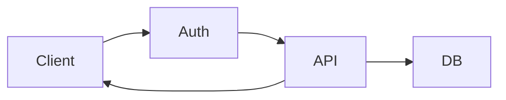

# Mermaid diagrams

Prefer Mermaid over ASCII art for all diagrams in documentation.

## When to use

- Architecture and flow diagrams in `docs/wiki/`
- Any diagram that shows relationships, sequences, or data flow

## Patterns

- Use `flowchart TD` or `flowchart LR` for flow/architecture diagrams
- Use `sequenceDiagram` for request/response flows
- Use `classDiagram` for type relationships

## Examples

````text
// BAD — ASCII art; hard to maintain, not diffable
Client --> [Auth] --> [API] --> [DB]
     ^                  |
     +------------------+

// GOOD — Mermaid; readable, maintainable, renders in GitHub

````
